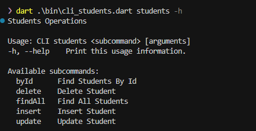

 CLI Students

 CLI de estudantes criado por mim, para subir o servidor RESTful, entre na pasta cli_api pelo prompt e ativa o servidor digitando jrs run

Comandos;

packages utilizados

   [dio](https://pub.dev/packages/dio)
   [json_rest](https://pub.dev/packages/json_rest_server)
   [args](https://pub.dev/packages/args)

  

utilizei boa prática de import, utilizando o linter
prefer_relative_imports

para dúvidas entre em contato: ramonsantospinto@gmail.com
